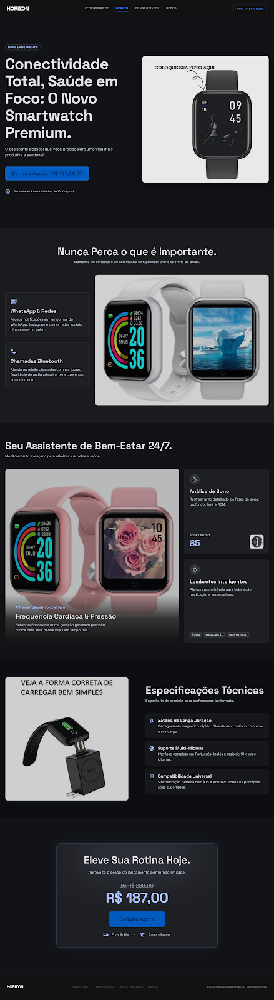

# Smartwatch Premium Landing Page - Horizon

Uma landing page moderna, responsiva e de alta conversão para o Smartwatch Horizon, desenvolvida com tecnologias web de ponta.

https://pagina-vendas-one.vercel.app/

## 🚀 Tecnologias

Este projeto foi construído utilizando:

- **React 18** - Biblioteca para interfaces de usuário.
- **Vite** - Build tool ultrarrápida.
- **Tailwind CSS** - Framework CSS utilitário para design personalizado.
- **Framer Motion** - Biblioteca para animações fluidas e interativas.
- **Lucide / Material Symbols** - Ícones modernos.

## 🛠️ Estrutura do Projeto

- `src/components/`: Componentes React modulares (Hero, Navbar, Features, etc).
- `src/styles/`: Configurações globais de estilo e Tailwind.
- `public/`: Assets estáticos (imagens e ícones).

---
Desenvolvido por [Joao Bruno Luz](https://github.com/JoaoBrunoLuz)
